# ENGSE203 LAB 4 — Student Evidence README

## ผู้จัดทำ

- ชื่อ–นามสกุล: กิตตินันท์ ผิวคำ
- รหัสนักศึกษา: 68543210020-2
- Section: 1

## URLs

- Repository: engse203-student-labs-68543210020
- Pull Request: https://github.com/kittinun12/engse203-student-labs-68543210020/pull/8
- GitHub Pages: https://kittinun12.github.io/engse203-student-labs-68543210020/

## Component Tree

```text
App (State: requests, statusFilter)
├── AppHeader (Props: title, subtitle)
├── SummaryPanel (Props: summary)
└── main.workspace-grid
    ├── RequestForm (State: formData, errors, status | Props: onAddRequest)
    └── section.panel
        ├── FilterBar (Props: value, onFilterChange)
        └── RequestList (Props: requests, onDeleteRequest)
            └── RequestCard (Props: request, onDeleteRequest)
```

## Setup และ Run

```bash
nvm use
npm install
npm run dev
npm run check
npm run build
npm run preview
```

## State / Props / Callback Explanation

State Ownership:

App เป็นเจ้าของ State หลัก ได้แก่ requests (รายการคำร้องทั้งหมด) และ statusFilter (สถานะที่ใช้กรอง) เพื่อให้คอมโพเนนต์อื่นใช้งานร่วมกันได้
RequestForm ถือ State ภายในเฉพาะตัว ได้แก่ formData (ข้อมูลฟอร์มแบบ Controlled Input), errors 
(ข้อความความผิดพลาด) และ status (ข้อความแสดงสถานะฟอร์ม)

Derived Data:

summary (สรุปจำนวนตามสถานะ) และ filteredRequests (รายการคำร้องที่ผ่านการกรอง) 
ถูกคำนวณจาก State requests และ statusFilter โดยตรงภายใน App โดยไม่ต้องสร้าง State ใหม่

Props Flow (Top-Down):

App ส่งข้อมูลลงไปยัง Child Components ผ่าน Props เช่น ส่ง summary ให้ SummaryPanel, 
ส่ง statusFilter ให้ FilterBar และส่ง filteredRequests ให้ RequestList

Callback Flow (Bottom-Up):

Child Components ส่งข้อมูลกลับมายัง App ผ่าน Callback Functions เช่น RequestForm เรียก onAddRequest(formData), 
FilterBar เรียก onFilterChange(status) และ RequestCard เรียก onDeleteRequest(id) เพื่อเปลี่ยน State ใน App

## Test Evidence

| Test ID | Actual Result | Pass/Fail | Evidence/Screenshot |
| --- | --- | --- | --- |
| TC-01 Initial | โหลดข้อมูลเริ่มต้นและแสดง Summary ถูกต้อง | pass | 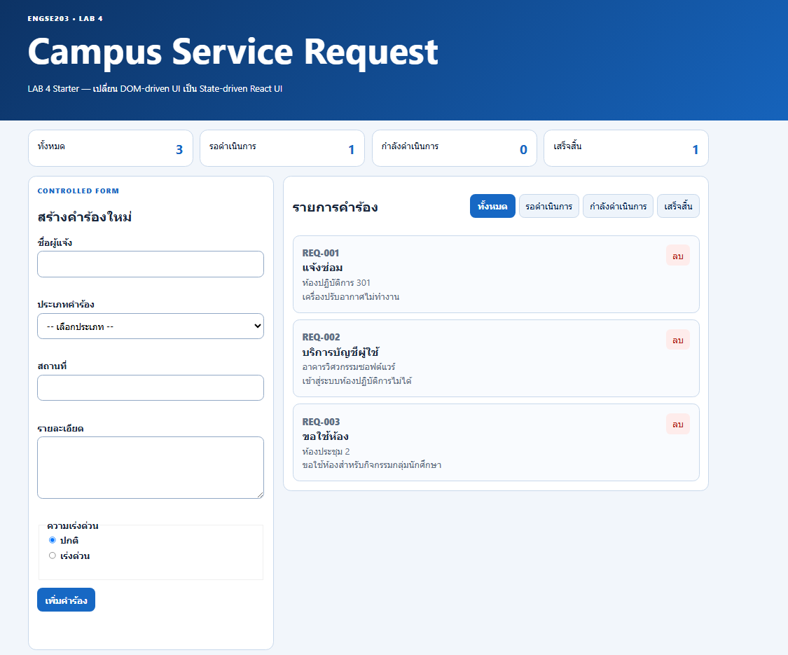 |
| TC-02 Controlled input | กรอกข้อมูลในแบบฟอร์มได้และค่าเปลี่ยนแปลงตามพิมพ์ | pass | 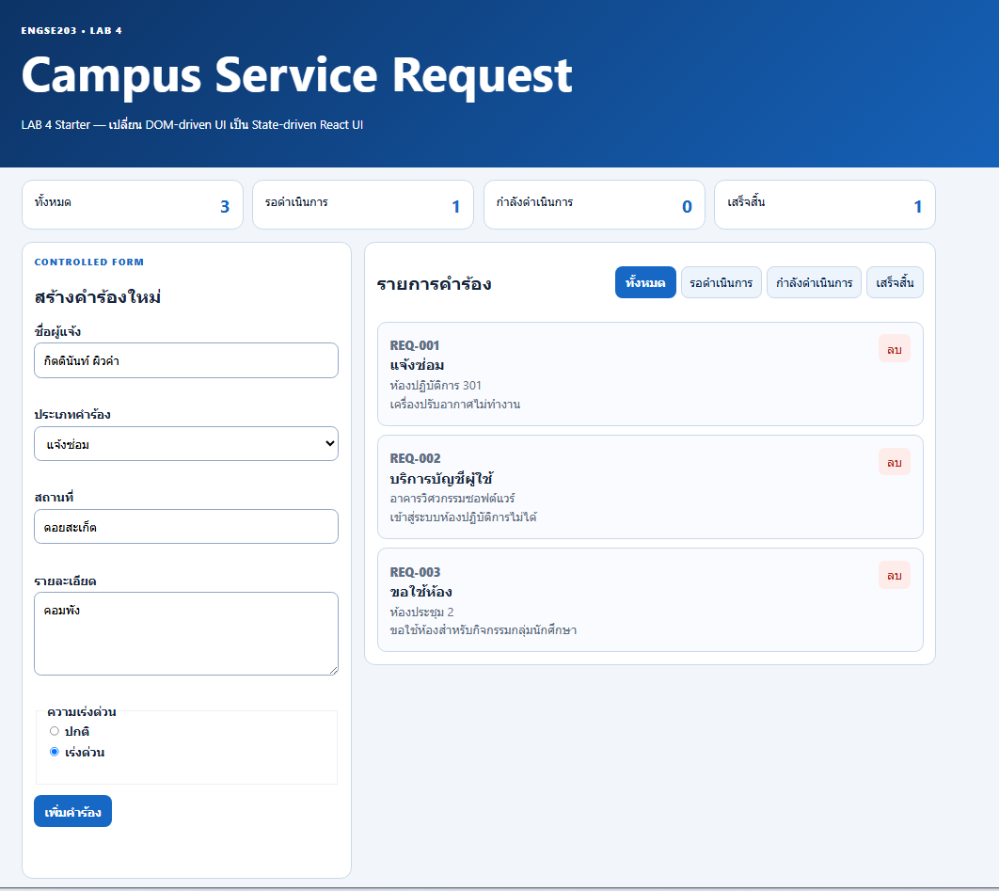 |
| TC-03 Invalid | แสดงข้อความแจ้งเตือน Error เมื่อส่งฟอร์มว่าง | pass | 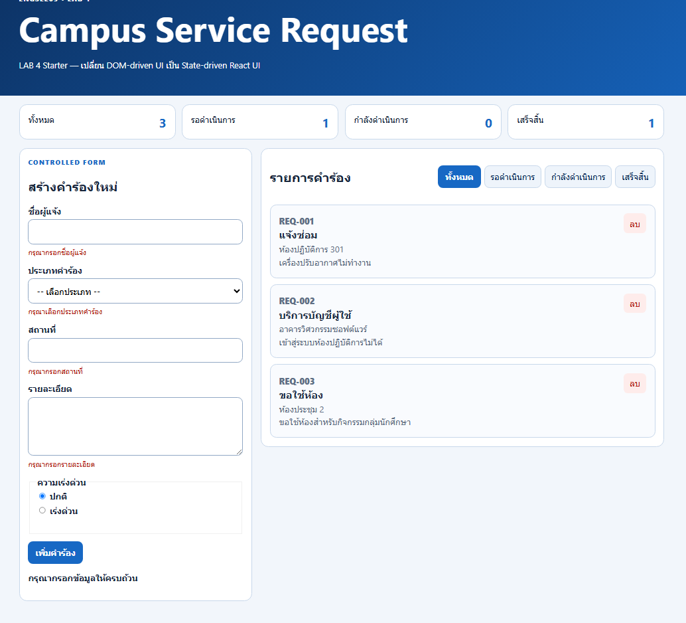 |
| TC-04 Valid add | เพิ่มคำร้องใหม่เข้าสู่ List และ Summary อัปเดตทันที | pass | 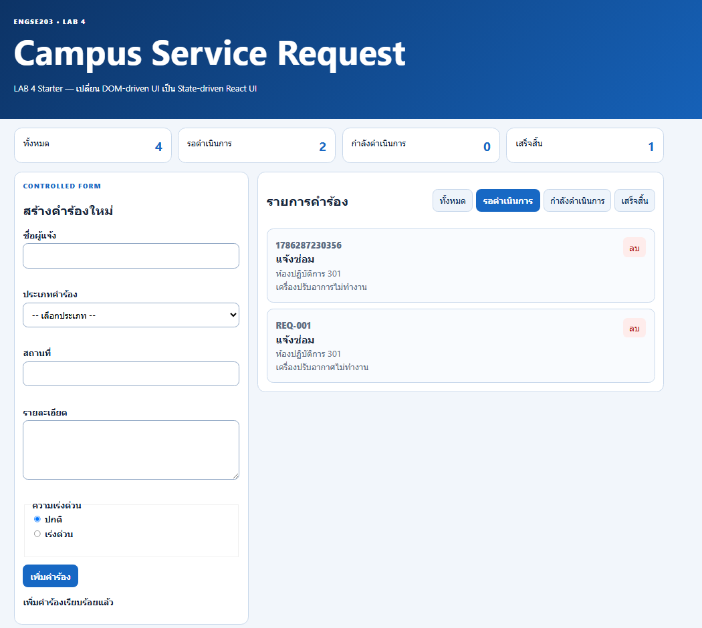 |
| TC-05 Filter | กรองรายการตามสถานะที่เลือกได้อย่างถูกต้อง | pass | 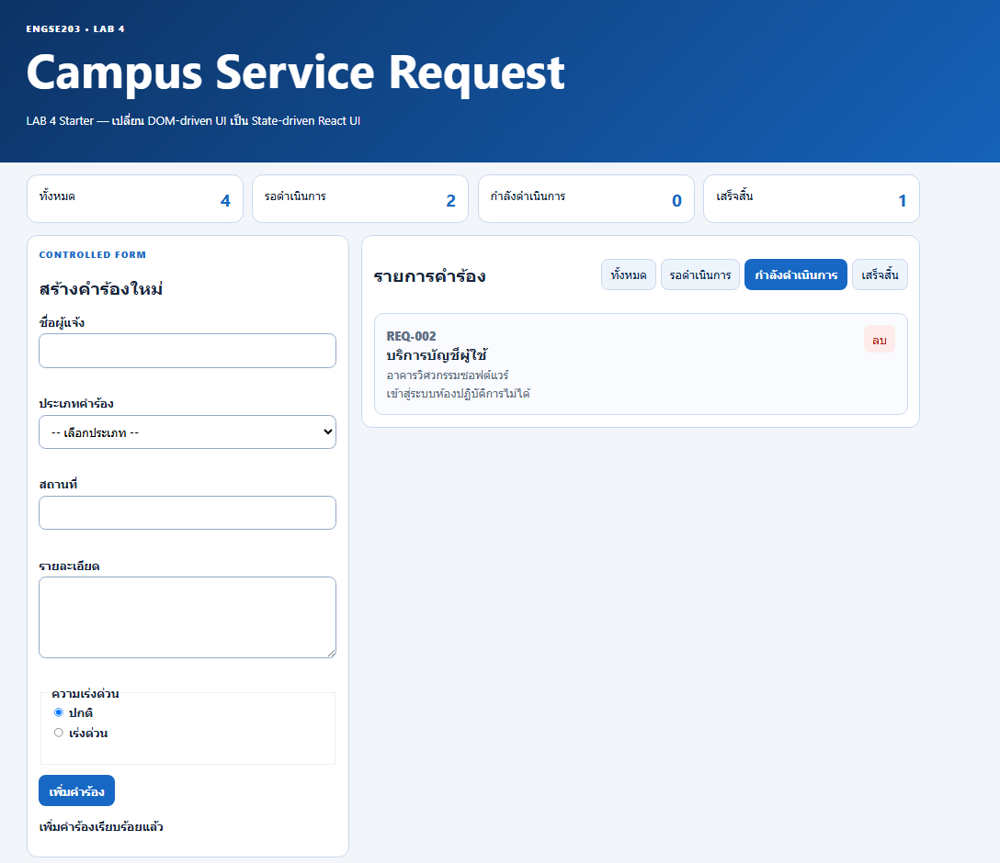 |
| TC-06 All | กดเลือกปุ่ม "ทั้งหมด" แล้วแสดงคำร้องครบทุกรายการ | pass | 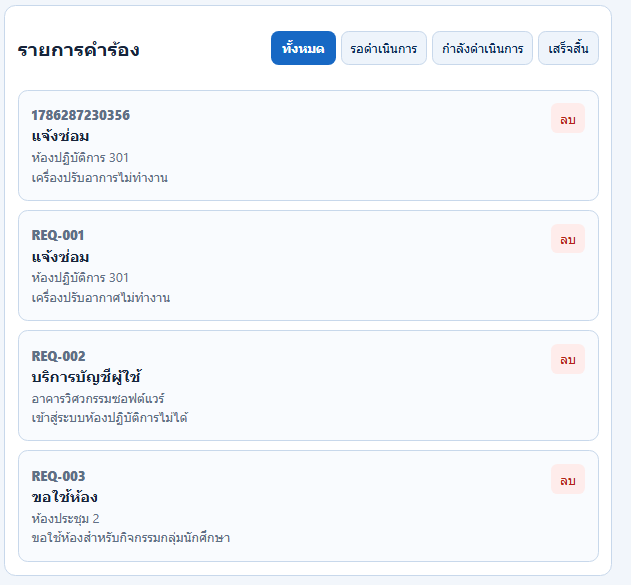 |
| TC-07 Empty | แสดงสถานะว่างเมื่อไม่มีคำร้องใด ๆ | pass | 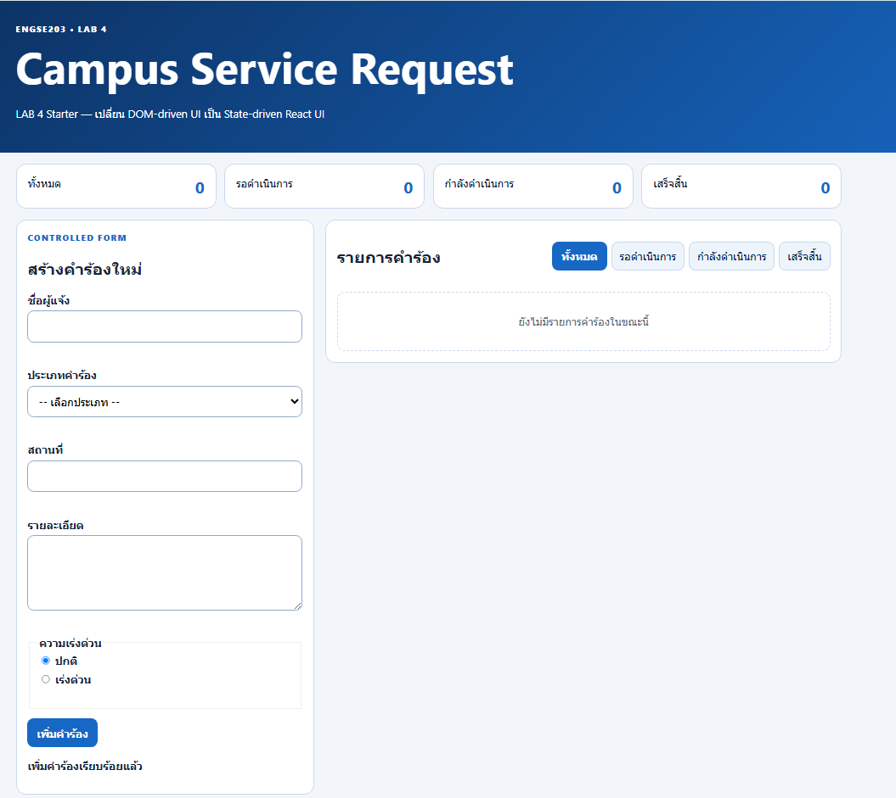 |
| TC-08 Delete | ลบคำร้องออกจาก List และ Summary อัปเดตทันที | pass |  |
| TC-09 Mobile | แสดงหน้าตาให้เหมาะสมกับหน้าจอขนาดเล็ก | pass | 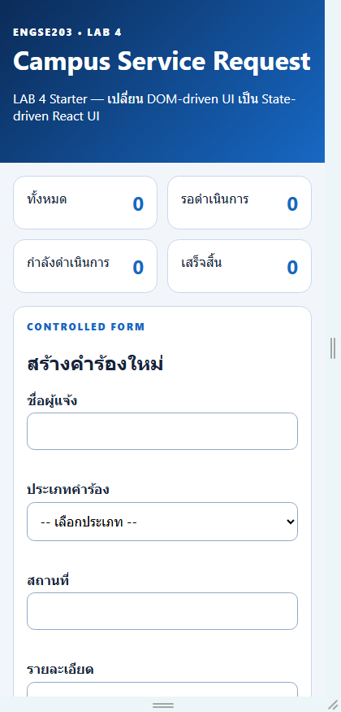 |
| TC-10 Keyboard | รองรับการนำทางด้วยคีย์บอร์ดได้อย่างถูกต้อง | pass | 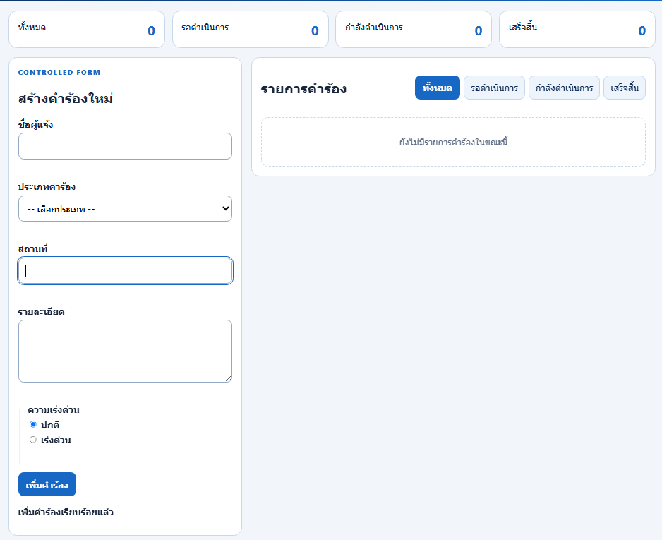 |
| TC-11 Build | การ build project เสร็จสมบูรณ์โดยไม่มีข้อผิดพลาด | pass | 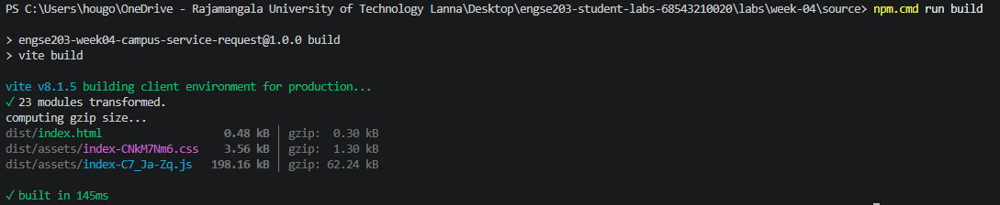 |
| TC-12 Pages | เว็บไซต์สามารถเข้าถึงได้ผ่าน URL เหมาะสม | pass | 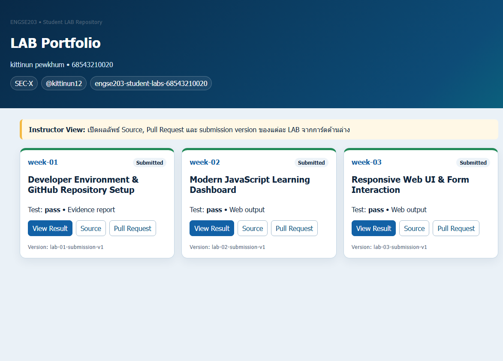 |

### Screenshots
* **Desktop:** 
* **Mobile 375px:** 
* **Validation/empty state:** , 

## Week 03 → Week 04 Reflection

ใน Week 03 การจัดการ UI ด้วย DOM Manipulation (Imperative) จำเป็นต้องคอยเลือก DOM element และแก้ไข innerHTML หรือเพิ่ม/ลบน็อดด้วยตัวเอง 
ซึ่งเสี่ยงต่อการเกิด Bug และยากต่อการซิงก์ข้อมูลให้ตรงกับ UI แต่ใน Week 04 การเปลี่ยนมาใช้ State-driven UI (Declarative) 
ของ React ทำให้การพัฒนาเป็นระบบขึ้นอย่างมาก เพียงแค่จัดการ State ให้ถูกต้อง ตัว React จะทำการ Re-render UI 
ตามข้อมูลปัจจุบันให้อัตโนมัติ ส่งผลให้เขียนโค้ดได้กระชับ อ่านง่าย และดูแลรักษาง่ายกว่าเดิมมาก

## AI / External Resource Disclosure

มีการใช้ Google Gemini AI ในการช่วยแนะนำโครงสร้าง State, Controlled Component Validation logic, 
และการเขียน CSS สไตล์สำหรับ Accessibility Focus Visible กับ Badge โดยมีการตรวจสอบความถูกต้องด้วยการทดสอบการทำงานของ React Component 
ในสภาพแวดล้อมจริง (Development Server) และสั่งรัน npm run check เพื่อยืนยันว่าไม่มีข้อผิดพลาด

